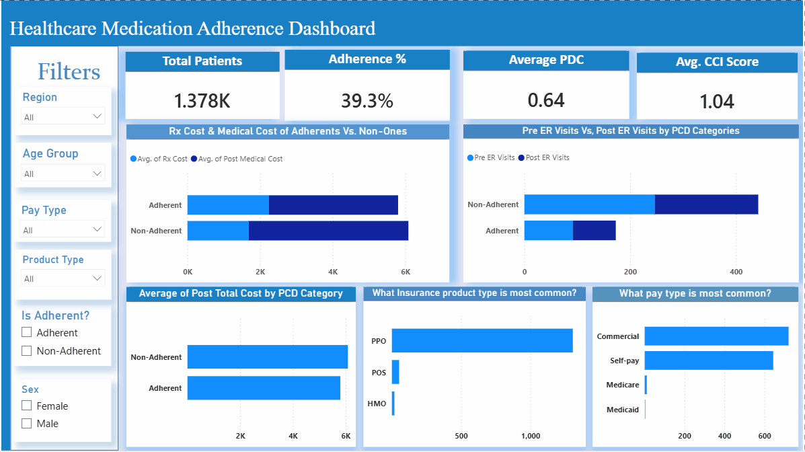

# Healthcare Medication Adherence Dashboard

## 📊 Project Overview
This is my first **Power BI** project, developed as a learning exercise in data analytics. The dashboard provides a high-level overview of patient medication adherence metrics and their correlation with healthcare costs and insurance types.

The primary goal of this report is to identify trends among **Adherent** vs. **Non-Adherent** patients, specifically looking at how adherence affects:
- Prescription (Rx) Costs
- Post-Medical Costs
- Emergency Room (ER) Visits
- Comorbidity (CCI) Scores

## 📈 Key Metrics & KPIs
The dashboard is structured around a central theme of patient adherence, calculated via **PDC (Proportion of Days Covered)** .

| Metric | Value |
|--------|-------|
| Total Patients | 1.378K |
| Adherence % | 39.3% |
| Average PDC | 0.64 |
| Avg. CCI Score | 1.04 |

## 🧩 Features & Visualizations

### 1. Global Filters
Users can slice the data by:
- **Region**
- **Age Group**
- **Pay Type** (Commercial, Self-pay, Medicare, Medicaid)
- **Product Type** (PPO, POS, HMO)

### 2. Cost Analysis: Adherents vs. Non-Adherents
- **Rx Cost & Medical Cost:** Compares the average prescription and post-medical costs between adherent and non-adherent groups
- **Pre vs. Post ER Visits:** Visualizes the difference in emergency room utilization before and after the intervention period for both groups

### 3. Insurance & Demographics Breakdown
- **Most Common Product Types:** Displays the distribution of PPO, POS, and HMO plans
- **Most Common Pay Types:** Highlights the breakdown between Commercial, Self-pay, Medicare, and Medicaid

### 4. Cost Trends by Adherence
- **Average Post Total Cost by PDC Category:** Analyzes the financial impact segmented by adherence level (Adherent vs. Non-Adherent)

## 💡 Key Insights

### Cost Correlation
The dashboard suggests that **Adherent** patients generally have lower average post-medical costs compared to Non-Adherent patients. This indicates that medication adherence may be a significant factor in reducing overall healthcare expenditure.

### ER Utilization
There is a visible trend in the differences between Pre and Post ER visits, indicating that adherence may influence healthcare resource utilization. Non-adherent patients tend to have higher ER utilization rates.

### Product Distribution
PPO plans appear to be the most common product type within this dataset, followed by POS and HMO plans.

### Pay Type Distribution
Commercial insurance is the most common pay type, with Medicare, Medicaid, and Self-pay following in descending order.

**By Maysa El-Dramally**